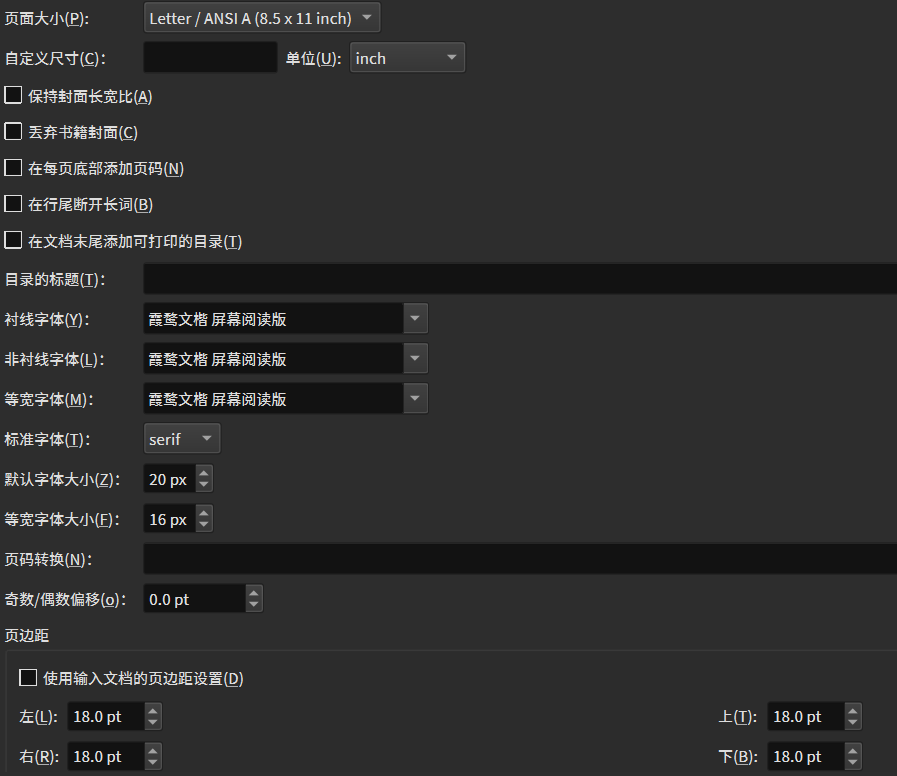

## 书途同归 Bookture

by Zyx Better_OIer

这是一个可以把`PDF`转化成图片，并把转化完成后图片合并成拼图的`Python`程序

## 用途

### 电子书

若用于转换`.epub`等电子书文件，本程序需搭配`Calibre`食用，推荐配置


对于`CovertPDFtoImg.py`，使用
```python
covertPDFtoImg(inDir, outDir, "PDF_name","jpg",2)
```

对于`MergeImg.py`，使用
```python
mergeImgs(inDir, outDir,"jpg",5,8,True,1)
```

可以**刚刚好**放进响应

### 普通A4文件

对于`CovertPDFtoImg.py`，使用
```python
covertPDFtoImg(inDir, outDir, "PDF_name","jpg",3)
```

对于`MergeImg.py`，使用
```python
mergeImgs(inDir, outDir,"jpg",3,4,True,1)
```

可以**刚刚好**放进响应